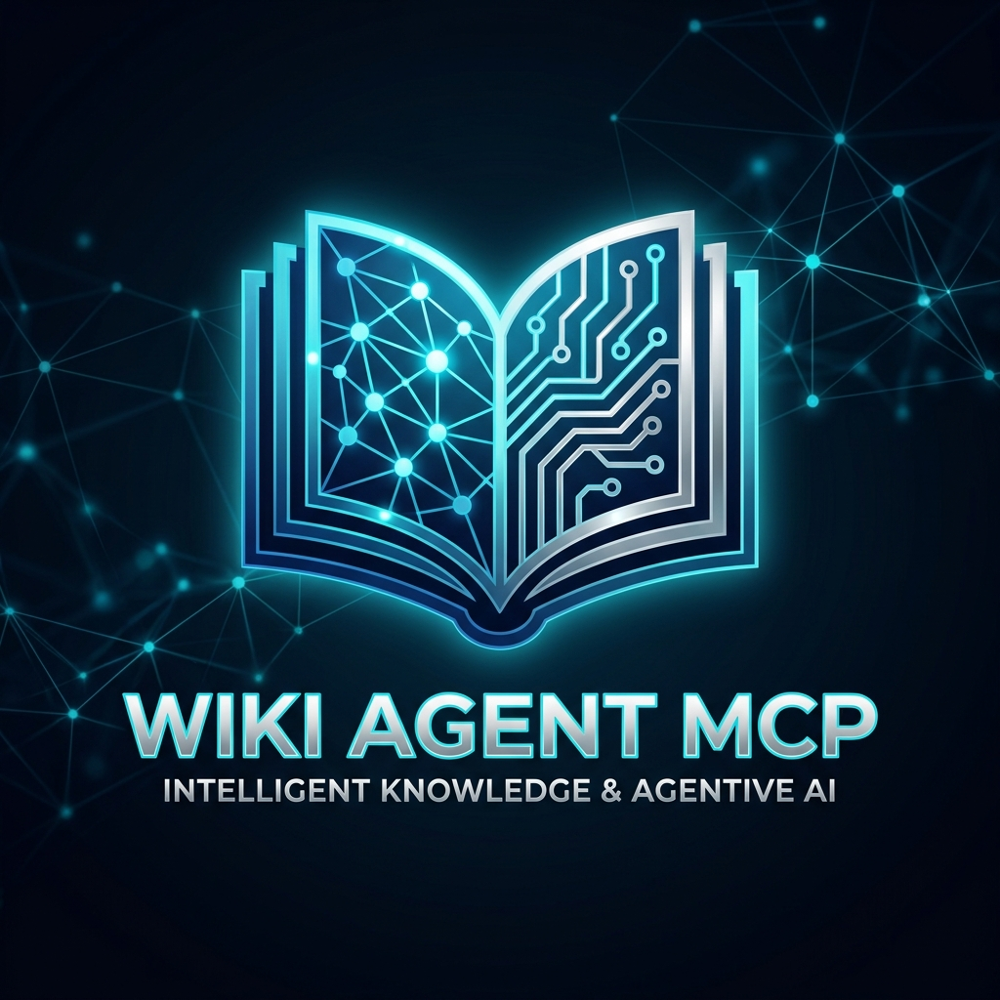

# 🧠 Wiki Agent: Premium Research Assistant

[](https://modelcontextprotocol.io)
[](https://www.python.org/)
[](https://opensource.org/licenses/MIT)

> **The state-of-the-art "Premium Research Assistant" experience powered by the Model Context Protocol.**  
> Transform raw curiosity into a structured, persistent knowledge base using a specialized multi-agent research lifecycle.

[**🛠️ Tools Reference**](docs/tools.md) | [**🧠 Storage & Memory**](docs/storage.md) | [**🏗️ Architecture**](docs/architecture.md) | [**🧪 Testing Guide**](docs/testing.md)

<p align="center">
  
</p>

---

## ✨ Features

- 🤖 **Three-Tier Agent System** – Specialized LLM personas for different depths:
  - **Level 1 (Outline Architect):** Conceptualizes the overall structure.
  - **Level 2 (Subtopic Expander):** Breaks down sections into granular subtopics.
  - **Level 3 (Article Writer):** Produces high-quality, comprehensive articles.
- 🔄 **Managed Research Lifecycle** – Enforces a professional workflow: Initiation → Exploration → Closure.
- 💾 **Zero-Loss Persistence** – Disk-based caching ensures your research is never lost, even across restarts.
- 🧠 **Smart Guidance** – Proactive next-step suggestions based on your exploration history and unanswered questions.
- 📊 **Executive Dossiers** – Professional research reports with gap analysis and knowledge maps.
- 🔍 **Universal Search** – Full-text search across your entire evolving knowledge base.

---

## 🚀 Quick Start

### 1. Installation

First, clone the repository:

```powershell
git clone https://github.com/iceberg-tribe/wiki-agent-mcp.git
cd wiki-agent-mcp
```

Then, choose one of the following methods to setup your environment:

#### Option A: Using `uv` (Recommended)

```powershell
# Install uv (if not already installed)
powershell -c "irm https://astral.sh/uv/install.ps1 | iex"

# Setup environment and install dependencies
uv venv
.venv\Scripts\activate
uv pip install -e .
```

#### Option B: Using standard Python & pip

```powershell
# Create virtual environment
python -m venv venv
venv\Scripts\activate

# Install dependencies
pip install -e .
```

### 2. Configuration

Set your LLM provider and API keys via environment variables:

```powershell
$env:LLM_PROVIDER="anthropic"           # "openai", "anthropic", or "ollama"
$env:ANTHROPIC_API_KEY="sk-ant-..."     # Your API key
$env:LLM_MODEL="claude-3-5-sonnet-latest"
```

### 3. Running the Server

Start the MCP server using either `uv` or `python`:

#### Using `uv` (No activation required)

```powershell
uv run python -m wiki_agent_mcp.main
```

#### Using standard Python (Requires venv activation)

```powershell
# Ensure your venv is activated first
python -m wiki_agent_mcp.main
```

---

## 🔌 Claude Desktop Integration

To use Wiki Agent within Claude Desktop, add the following to your configuration file:

**File Path:** `%APPDATA%\Roaming\Claude\claude_desktop_config.json`

```json
{
  "mcpServers": {
    "wiki-agent": {
      "command": "uv",
      "args": [
        "run",
        "--directory", "D:/dev-projects/wiki-mcp",
        "python", "-m", "wiki_agent_mcp.main"
      ],
      "env": {
        "LLM_PROVIDER": "anthropic",
        "ANTHROPIC_API_KEY": "your-key-here",
        "LLM_MODEL": "claude-3-5-sonnet-latest",
        "WIKI_DATA_DIR": "D:/dev-projects/wiki-mcp/data"
      }
    }
  }
}

> [!TIP]
> **Premium Tip:** Once connected, you can use the `@wiki-session` prompt in Claude to start a structured research session with guided instructions and lifecycle management.
```

> [!IMPORTANT]
> Ensure you replace the paths and API keys with your actual values. Restart Claude Desktop after saving.

---

## 🛠️ Available MCP Tools

| Tool | Description |
| :--- | :--- |
| `generate_level1` | Creates the main Table of Contents for a new topic. |
| `generate_level2` | Expands a specific section into detailed subtopics. |
| `generate_level3` | Writes a comprehensive wiki article for a subtopic. |
| `record_visit` | Marks a node as explored in the current session. |
| `generate_report` | Generates a session summary with gap analysis and recommendations. |
| `search_level3` | Performs full-text search across all generated articles. |
| `get_session_summary` | Provides statistics on the current exploration session. |
| `add_user_query` | Logs a specific user question for later report inclusion. |

---

## ⚙️ Configuration Options

| Variable | Description | Default |
| :--- | :--- | :--- |
| `LLM_PROVIDER` | `openai`, `anthropic`, or `ollama` | `openai` |
| `OPENAI_API_KEY` | Your OpenAI API key | - |
| `ANTHROPIC_API_KEY` | Your Anthropic API key | - |
| `LLM_MODEL` | Specific model identifier | Provider default |
| `WIKI_DATA_DIR` | Directory for SQLite DB and caches | `~/Downloads/wiki_data` |

---

## 🧪 Testing

We provide a comprehensive testing suite and multiple ways to verify the server locally.

For detailed instructions on using the MCP Inspector, manual JSON-RPC testing, and unit tests, see our:
👉 [**Detailed Testing Guide**](docs/testing.md)

### Quick Handshake Check
```powershell
echo '{"jsonrpc":"2.0","id":1,"method":"tools/list","params":{}}' | uv run python -m wiki_agent_mcp.main
```


---

## 🤝 Contributing

Contributions are welcome! Please follow these steps:

1. Fork the repository.
2. Create a feature branch (`git checkout -b feature/amazing-feature`).
3. Commit your changes (`git commit -m 'Add some amazing feature'`).
4. Push to the branch (`git push origin feature/amazing-feature`).
5. Open a Pull Request.

---

## 📄 License

Distributed under the MIT License. See `LICENSE` for more information.

MIT © [Iceberg Tribe](https://github.com/iceberg-tribe)

---

<p align="center">
  Built with ❤️ for the MCP Ecosystem
</p>
